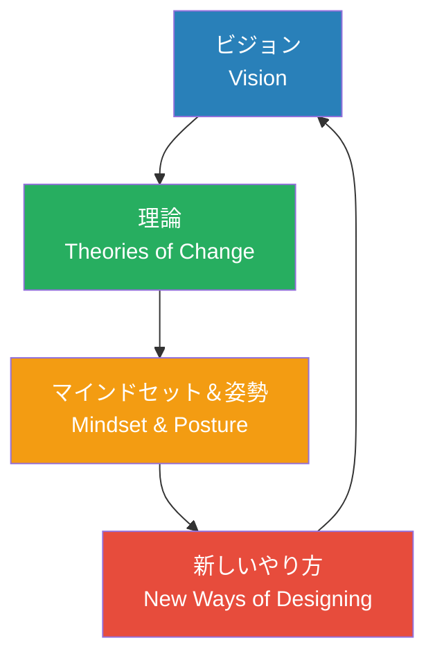
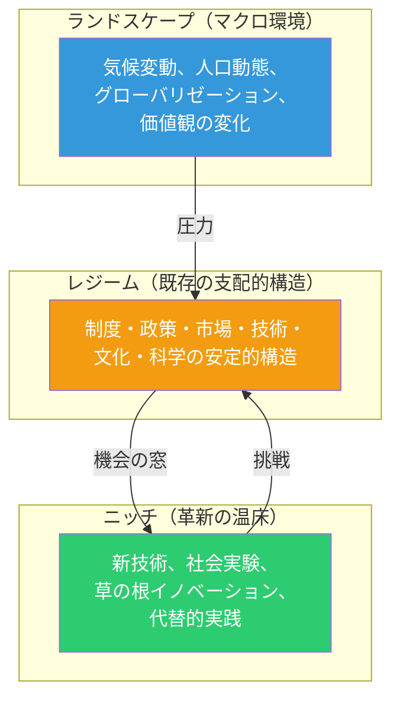
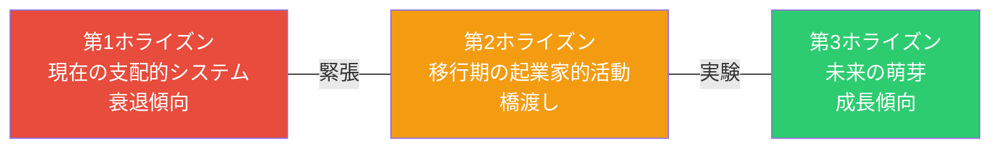
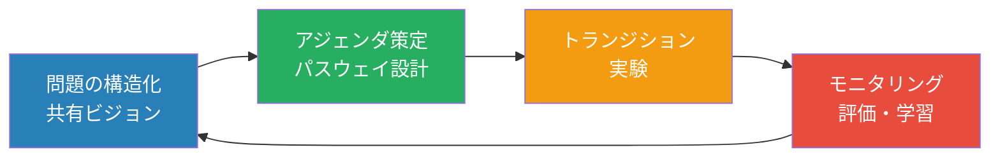

# 第3章 トランジションデザイン

**Transition Design — 社会システムの長期的変革を設計する**

## はじめに

気候変動、格差の拡大、高齢化社会、民主主義の揺らぎ――これらの課題は、個別のプロダクトやサービスの改善では解決できない。必要なのは、社会技術システムそのものの根本的な転換、すなわち**トランジション**である。

トランジションデザインは、カーネギーメロン大学のTerry Irwin、Gideon Kossoff、Cameron Tonkinwiseらが体系化した、社会の長期的な転換をデザインの視点から導く方法論である。Book 2で学んだ未来洞察、Book 3で学んだ社会変革デザイン、Book 6で学んだサステナビリティの知識が、本章で統合される。

## カーネギーメロン大学フレームワーク

トランジションデザインフレームワークは、4つの相互に連関する領域から構成される。

### 1. ビジョン（Vision）

トランジションデザインは、未来のライフスタイルに関する長期的なビジョンの構築から始まる。このビジョンは、Book 2で学んだスペキュラティブデザインやデザインフィクションの手法を活用して描かれる。

!!! tip "ビジョンの特性"
    トランジションデザインにおけるビジョンは、単なる予測ではなく「望ましい未来の暫定的な描写」である。コミュニティや地域の文脈に根ざし、ステークホルダーとの対話を通じて継続的に更新されるものでなければならない。

### 2. 変化の理論（Theories of Change）

社会変革がどのように起こるかについての理論的基盤である。複雑適応系理論、社会的実践理論、ストラテジック・ニッチ・マネジメントなど、多領域の知見を統合する。

### 3. マインドセットと姿勢（Mindset & Posture）

デザイナー自身の世界観と態度の転換を求める。個人主義的な問題解決者から、エコシステムの一員としての協働的なファシリテーターへの変容が必要である。

### 4. 新しいデザインの方法（New Ways of Designing）

既存のデザイン手法（HCD、参加型デザイン、システムデザインなど）を、長期的な社会転換の文脈で再構成する実践方法である。

## 社会技術トランジション（Socio-Technical Transitions）

社会技術トランジション理論は、技術と社会の共進化のダイナミクスを理解するための枠組みである。Frank Geelsが体系化したこの理論は、トランジションデザインの中核的な理論基盤となっている。

### トランジションのパターン

社会技術システムの転換は、以下のパターンで起こることが歴史的に観察されている。

| パターン | 説明 | 事例 |
|----------|------|------|
| **技術的代替** | 新技術が既存技術を置換 | 馬車から自動車へ |
| **変換** | 既存レジームが段階的に変容 | エネルギーシステムの脱炭素化 |
| **再構成** | ニッチ技術がレジームに取り込まれ変化を促進 | 再生可能エネルギーの電力網統合 |
| **脱整列・再整列** | 既存レジームが崩壊し新たな構成が出現 | COVID-19後の働き方の転換 |

## マルチレベルパースペクティブ（MLP）

MLPは、社会技術トランジションを理解する最も影響力のある分析フレームワークである。3つのレベル（ランドスケープ・レジーム・ニッチ）の相互作用として変化を捉える。

**ランドスケープ**は、気候変動や人口動態など、個別のアクターが容易に変えられないマクロ環境。**レジーム**は、現在の社会を支える支配的な制度・技術・文化の安定した構造。**ニッチ**は、オルタナティブな技術や実践が実験される保護された空間である。

トランジションは、ランドスケープの変化がレジームに圧力をかけ、ニッチのイノベーションがレジームの隙間に入り込む時に起こる。

!!! example "モビリティのトランジション"
    自動車中心のモビリティ・レジームに対して、気候変動（ランドスケープ圧力）が脱炭素を要求し、EV・カーシェア・MaaS（ニッチ）が既存の構造を揺さぶっている。2026年現在、多くの都市でこの転換が進行中であり、都市計画・交通政策・インフラ・市民の移動習慣が同時に変化しつつある。

## ロングホライズンデザイン

トランジションデザインは、通常のデザインプロジェクト（数週間〜数ヶ月）とは異なる、数十年単位の時間軸で設計する。

### 3つのホライズン・フレームワーク

Bill Sharpeが提唱した「Three Horizons」フレームワークは、現在と未来の関係を構造化するツールとして、トランジションデザインで頻繁に活用される。

- **第1ホライズン（H1）** — 現在の支配的なシステム。効率化は可能だが根本的変革には限界がある
- **第2ホライズン（H2）** — H1とH3の間を橋渡しする活動。スタートアップ、社会実験、政策パイロットなど
- **第3ホライズン（H3）** — 未来のシステムの萌芽。現在は周縁的だが、将来の主流となる可能性を持つ

!!! warning "H2の二面性"
    第2ホライズンの活動は、H3（望ましい未来）に向かう変革を促進する「H2+」と、H1（現在のシステム）を延命させる「H2-」の両面を持つ。例えば、ハイブリッド車は脱炭素に向けた橋渡し（H2+）とも、内燃機関の延命（H2-）とも解釈できる。デザイナーは自身の活動がどちらに寄与しているかを常に問い直す必要がある。

## システムチェンジのためのデザイン

トランジションデザインが対象とするシステムチェンジは、以下の複数のレバレッジポイントに同時に働きかけることを要求する。

ドネラ・メドウズの「システムのレバレッジポイント」に基づき、介入の深さを理解する。

| 介入の深さ | レバレッジポイント | トランジションデザインでの対応 |
|-----------|-------------------|---------------------------|
| **浅い** | パラメーターの調整 | 既存サービスの改善 |
| **中程度** | フィードバックループの変更 | 新しいインセンティブ構造の設計 |
| **深い** | 情報の流れの変更 | データの透明化とオープン化 |
| **最も深い** | パラダイムの転換 | 社会の根本的な前提の問い直し |

!!! note "デザイナーの介入レベル"
    従来のデザインは浅いレバレッジポイントに留まることが多いが、トランジションデザインは最も深いレベル――パラダイムの転換――にまで介入することを志向する。これは個人の努力ではなく、多様なステークホルダーとの長期的な協働を通じて初めて可能となる。

## トランジションマネジメント

オランダで発展したトランジションマネジメント（TM）は、トランジションの理論を政策実践に接続するガバナンスアプローチである。

**TMの4つのフェーズ：**

1. **問題の構造化と共有ビジョンの形成** — 多様なステークホルダーが集い、現在のシステムの問題と望ましい未来像を共同で定義する（トランジション・アリーナ）
2. **トランジション・アジェンダの策定** — 共有ビジョンに向けた経路（パスウェイ）と戦略を具体化する
3. **トランジション実験の実施** — 小規模な実験を通じて学びを蓄積する
4. **モニタリングと評価** — 実験の成果を評価し、ビジョンとアジェンダを更新する

!!! example "オランダのエネルギートランジション"
    オランダ政府は2001年からトランジションマネジメントのアプローチをエネルギー政策に適用した。政府・企業・市民・研究者が参加するトランジション・アリーナを設置し、持続可能なエネルギーシステムへの長期的な転換を推進している。小規模な実験（地域の再生可能エネルギー協同組合など）から学びを蓄積し、政策にフィードバックする仕組みが構築された。

## デザイナーの新しい役割

トランジションデザインにおいて、デザイナーは以下の役割を担う。

- **ビジョナリー** — 望ましい未来のビジョンを視覚化し、共有可能にする
- **ファシリテーター** — 多様なステークホルダーの対話を促進する
- **プロトタイパー** — 未来の暮らしの一端を今日の文脈で実験する
- **コネクター** — ニッチの実験とレジームの変革を架橋する
- **リフレクティブ・プラクティショナー** — 自身の実践と前提を常に問い直す

---

## 演習

### 演習1：MLPマッピング
自分が関心を持つ社会課題（食、エネルギー、教育、医療など）を一つ選び、MLPの3レベル（ランドスケープ・レジーム・ニッチ）を用いて現状を分析するマップを作成せよ。各レベルに5つ以上の要素を配置し、レベル間の相互作用を矢印で示すこと。

### 演習2：3ホライズン・ワークショップ設計
上記の社会課題について、3つのホライズン・フレームワークを用いたワークショップの設計書を作成せよ。参加者構成、ワークショップの流れ（90分）、使用するツール、期待されるアウトプットを定義すること。

### 演習3：トランジション実験の提案
演習1で分析した課題に対するトランジション実験を3つ提案せよ。各実験について、仮説、規模、期間、参加者、成功指標、レジームへのスケーリング方法を記述すること。
