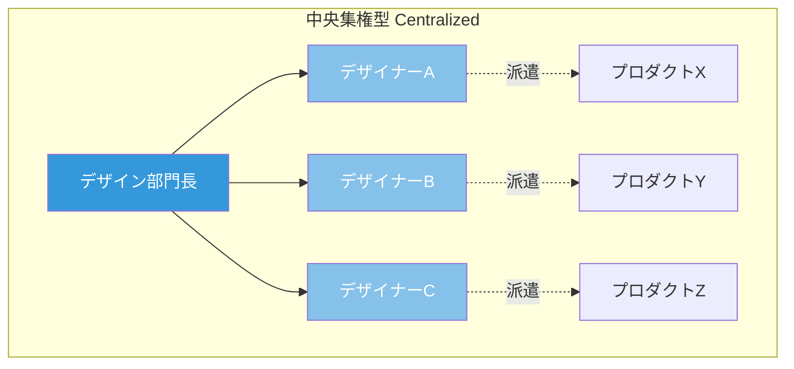
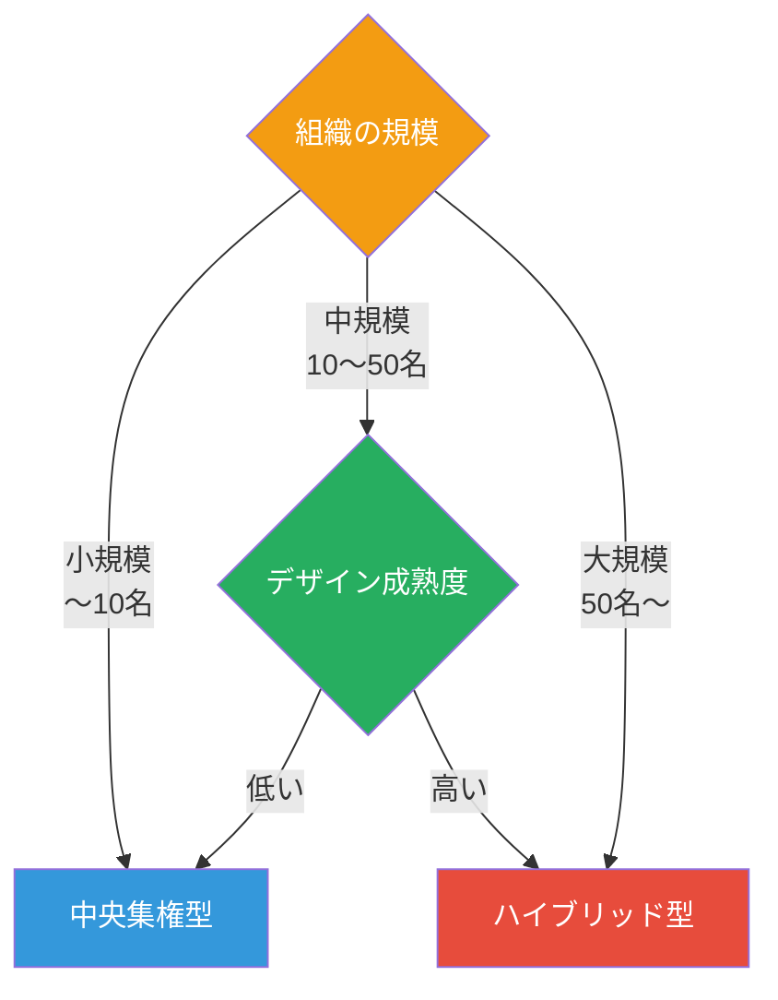
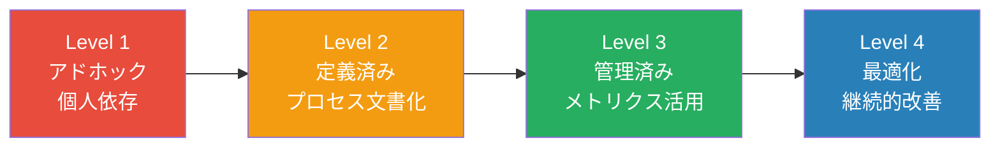
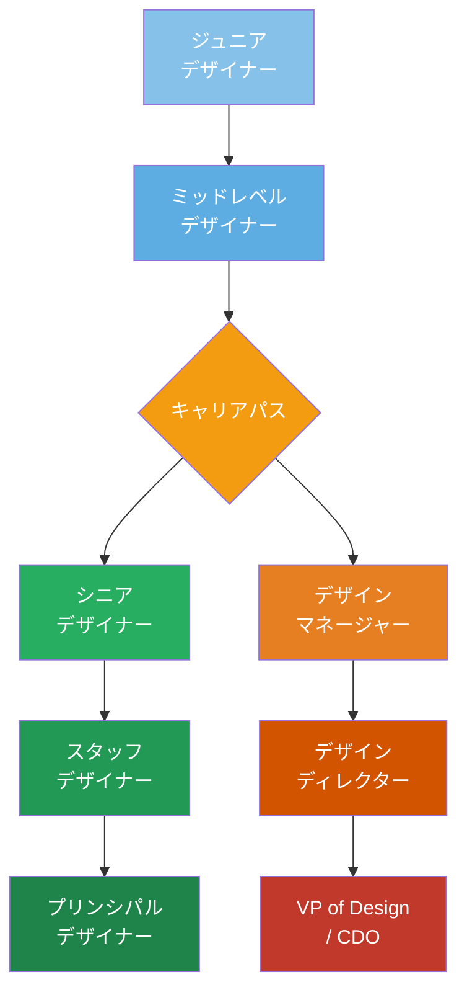

# 第4章 デザイン組織論

**Design Organizations — デザインの力を組織に根付かせる**

## はじめに

優れたデザインは、個人の才能からではなく、優れた組織から生まれる。一人のスターデザイナーに依存する組織は脆弱であり、デザインの価値を持続的に発揮するためには、組織構造、プロセス、文化の三位一体で設計する必要がある。

本章では、デザインチームの構造設計からDesignOps（デザインオペレーション）、デザイン文化の醸成、人材の採用と育成まで、デザイン組織のリーダーに必要な実践知を体系的に学ぶ。

## デザインチームの構造

デザインチームの組織構造は、大きく3つのモデルに分類される。それぞれにメリットとデメリットがあり、組織の規模、成熟度、事業構造に応じて最適なモデルは異なる。

### 3つの組織モデル

| モデル | 特徴 | メリット | デメリット |
|--------|------|----------|-----------|
| **中央集権型** | デザイナーが一つの部門に所属し、プロジェクトに派遣される | 品質の一貫性、スキル育成の効率、デザイン文化の維持 | プロダクトチームとの距離、コンテキスト理解の浅さ |
| **分散型（Embedded）** | デザイナーが各プロダクトチームに所属する | プロダクトへの深い理解、迅速な意思決定 | デザイン品質のばらつき、孤立感、キャリアパスの不明確さ |
| **ハイブリッド型** | 中央のデザイン組織が基準を設定し、デザイナーはプロダクトチームに配属 | 一貫性と柔軟性の両立 | 二重のレポートライン、運用コストの高さ |

!!! tip "Spotifyモデルの影響"
    Spotifyが提唱したSquad/Tribe/Chapter/Guildモデルは、多くのテック企業のデザイン組織に影響を与えた。デザイナーはSquad（プロダクトチーム）に所属しながら、Chapter（デザイン職能グループ）でスキル開発を行い、Guild（関心テーマのコミュニティ）で知見を共有する。これはハイブリッド型の一形態である。

### 組織モデルの選択基準

!!! warning "組織構造の変更コスト"
    組織構造の変更は、人的関係、情報フロー、意思決定プロセスの全てに影響する。安易な再編は混乱を招き、優秀な人材の離脱につながる。構造変更は、明確な課題認識と移行計画を伴って段階的に実施すべきである。

## DesignOps（デザインオペレーション）

DesignOpsは、デザインチームが最大の価値を発揮できるよう、プロセス・ツール・人材の最適化を担う機能である。DevOpsがソフトウェア開発のデリバリーを最適化するように、DesignOpsはデザインのデリバリーを最適化する。

### DesignOpsの3つの柱

| 柱 | 内容 | 具体的な活動 |
|----|------|-------------|
| **ビジネスオペレーション** | チームの運営と戦略 | 予算管理、ベンダー管理、ROI測定、ステークホルダー管理 |
| **ピープルオペレーション** | 人材と文化 | 採用、オンボーディング、スキル開発、パフォーマンス評価 |
| **ワークフローオペレーション** | プロセスとツール | デザインシステム管理、ツールチェーン最適化、品質基準、ハンドオフプロセス |

### DesignOpsの成熟度

!!! example "Airbnbのデザインオペレーション"
    Airbnbは、DesignOps専任チームを設置し、デザインシステム（DLS: Design Language System）の運用、ユーザーリサーチの組織化、デザインプロセスの標準化を推進した。これにより、グローバルに分散するデザインチームの一貫性を維持しながら、各チームの自律性を確保する仕組みを構築している。

## デザインのスケーリング

組織の成長に伴い、デザインチームをスケールさせる必要が生じる。スケーリングは単にデザイナーの人数を増やすことではなく、組織としてのデザイン能力を体系的に拡大することである。

### スケーリングの4つの戦略

1. **デザインシステムの構築** — コンポーネント、パターン、ガイドラインを体系化し、一貫性のあるデザインを効率的に展開する。Book 5で学んだAIの活用も、デザインシステムの自動化に効果的である。

2. **デザインプリンシプルの明文化** — 組織のデザイン判断の基準を言語化する。「ユーザーの時間を尊重する」「複雑さを隠さず、理解しやすくする」といった原則が、分散型のチームでも一貫した判断を可能にする。

3. **デザインリテラシーの全社展開** — エンジニア、プロダクトマネージャー、マーケターなど、非デザイナーのデザインリテラシーを向上させる。ワークショップ、社内教育、デザインレビューへの参加を通じて、デザイン的思考を組織全体に浸透させる。

4. **テンプレートとツールキットの提供** — リサーチテンプレート、プレゼンテーションフォーマット、アクセシビリティチェックリストなど、標準化されたツールキットを提供し、品質の底上げを図る。

## デザイン文化の醸成

組織構造とプロセスの整備だけでは、デザインの力は最大化されない。**デザイン文化**――すなわち、デザイン的な価値観が組織の日常に浸透した状態――を醸成することが不可欠である。

### デザイン文化の構成要素

| 要素 | 説明 | 実践方法 |
|------|------|----------|
| **好奇心** | 問いを立て、探求する姿勢 | リサーチの日常化、デザインスプリント |
| **実験** | 失敗を許容し、学びに変える | プロトタイピング文化、A/Bテスト |
| **クラフトマンシップ** | 細部への執着と品質追求 | デザインクリティーク、ピアレビュー |
| **共感** | ユーザーとチームメンバーへの深い理解 | ユーザー接点の定期化、心理的安全性 |
| **協働** | 職能を超えた共同創造 | コデザインセッション、ペアデザイン |

!!! note "心理的安全性とデザイン文化"
    デザインクリティーク（作品批評）は、デザイン文化の中核的な実践である。しかし、心理的安全性が確保されていない環境では、クリティークは攻撃や評価と受け取られ、メンバーのリスクテイクを阻害する。Amy Edmondsonの研究が示すように、心理的安全性はチームパフォーマンスの最も強い予測因子である。

### デザインクリティークの運営

効果的なデザインクリティークのフォーマット：

1. **コンテキストの共有**（2分）— プレゼンターが問題定義、制約条件、フィードバックを求めるポイントを説明する
2. **サイレントレビュー**（5分）— 参加者が各自で作品を確認し、付箋やコメントを記録する
3. **フィードバック**（15分）— 「I like / I wish / What if」フレームワークを用いて建設的なフィードバックを共有する
4. **ディスカッション**（10分）— 共通するテーマや優先度について議論する
5. **ネクストステップの確認**（3分）— プレゼンターがアクションアイテムを確認する

## デザイナーの採用と育成

### 採用プロセスの設計

| フェーズ | 評価内容 | 手法 |
|----------|----------|------|
| **書類選考** | ポートフォリオの質とプロセス思考 | ポートフォリオレビュー |
| **デザインチャレンジ** | 問題解決能力と思考プロセス | ホワイトボードチャレンジ or 持ち帰り課題 |
| **チーム面接** | コラボレーション能力、コミュニケーション | パネルインタビュー |
| **カルチャーフィット** | 価値観の共有、成長意欲 | カジュアル面談 |

!!! warning "ポートフォリオの「見た目」の罠"
    採用時にポートフォリオのビジュアルの美しさだけで評価するのは危険である。重要なのは、どのような問題をどのように定義し、どのプロセスでどのような判断を行い、どのような成果を生み出したかという**思考の質**である。Chapter 5でポートフォリオの構築方法を詳しく扱う。

### メンタリングとキャリア開発

デザイナーの成長を支援するために、以下の仕組みを構築する。

- **スキルマトリクス** — デザイン職能に必要なスキルを体系化し、各メンバーの現在地と成長方向を可視化する
- **1on1ミーティング** — 週次または隔週で、マネージャーとデザイナーが対話する場を設ける
- **メンター制度** — シニアデザイナーがジュニアデザイナーの成長を伴走する
- **デザインギルド** — 関心テーマ別のコミュニティで自発的な学びを促進する
- **カンファレンス参加・登壇** — 外部コミュニティとの接点を奨励する

!!! tip "ICとマネジメントのデュアルラダー"
    デザイナーのキャリアパスは、個人貢献者（IC：Individual Contributor）トラックとマネジメントトラックの2つを用意すべきである。優れたデザイナーが必ずしも優れたマネージャーになるわけではなく、IC路線でもシニアリティを高められるキャリアパスが必要である。

---

## 演習

### 演習1：デザイン組織構造の設計
従業員500名、デザイナー20名の中規模テック企業を想定し、最適なデザイン組織構造を提案せよ。組織図、レポートライン、他部門との連携方法、DesignOpsの配置を含めること。選択した構造の根拠も明記すること。

### 演習2：デザインクリティークの導入計画
デザインクリティークの文化がない組織に、この実践を導入するための3ヶ月間の計画を策定せよ。心理的安全性の確保策、段階的な導入ステップ、成功指標を含めること。

### 演習3：デザイナーのスキルマトリクス作成
自身の専門領域（UI/UXデザイン、サービスデザイン、ブランドデザインなど）について、ジュニアからシニアまでの3段階のスキルマトリクスを作成せよ。技術スキル、ソフトスキル、リーダーシップスキルの3カテゴリ、各カテゴリ5項目以上を定義すること。
