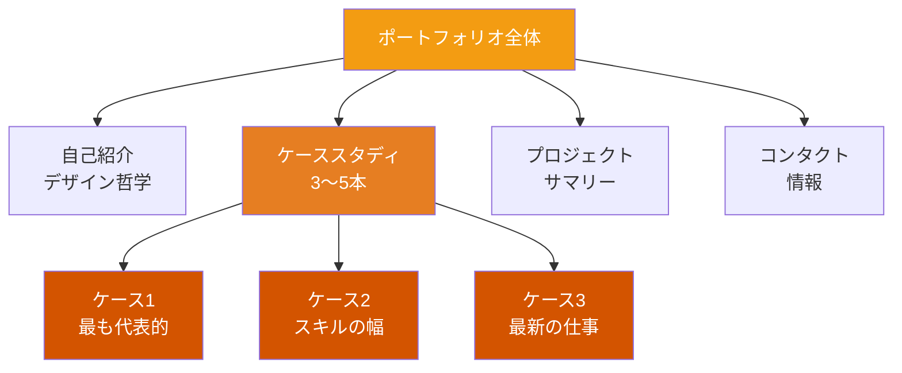
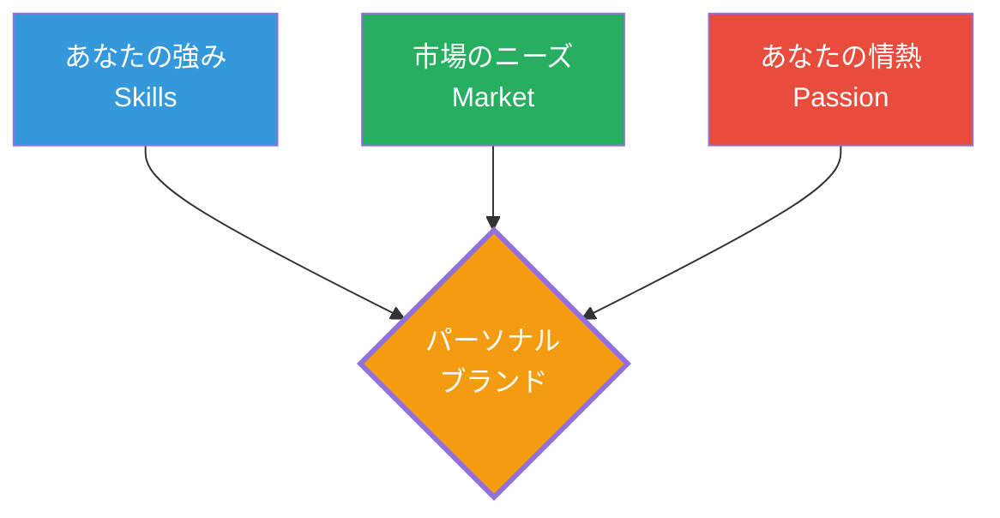
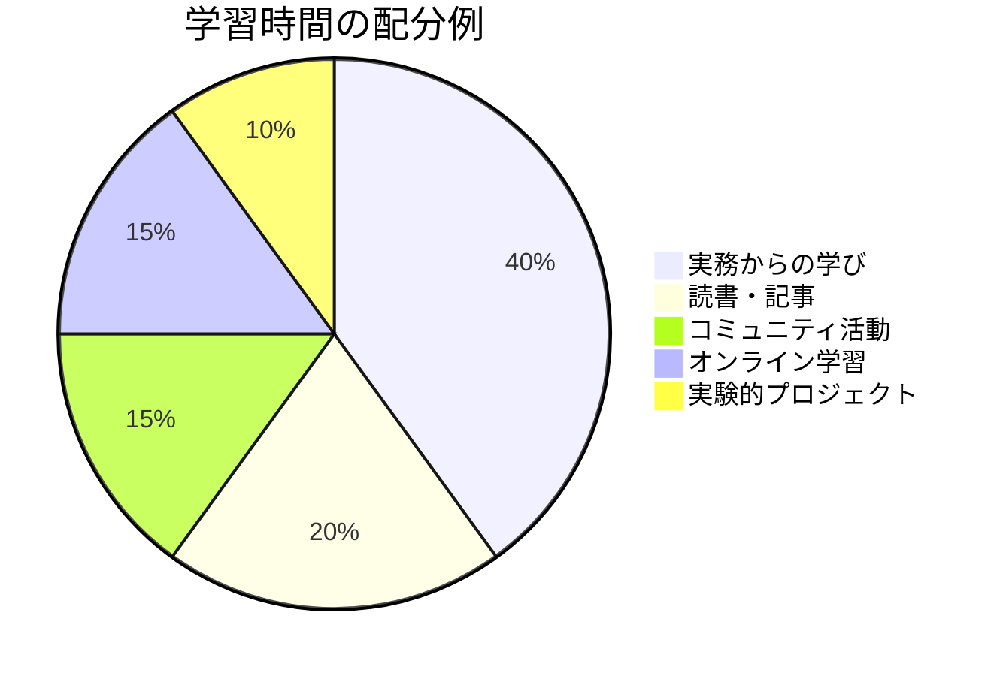
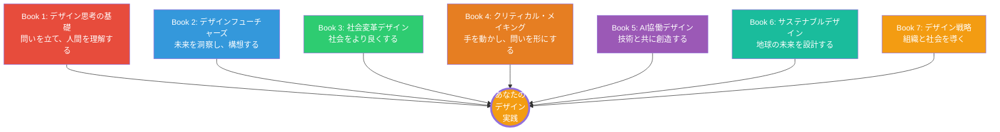

# 第5章 ポートフォリオと実践

**Portfolio & Practice — デザイナーとしてのキャリアを自律的に構築する**

## はじめに

Book 1から本書までの6冊半で、デザインの理論・手法・思想を体系的に学んできた。しかし、学びは実践に転換されなければ意味を持たない。本章は、カリキュラム全体の最終章として、学んだ知識を「自分自身のキャリア」という最も個人的なプロジェクトに適用する方法を扱う。

2026年のデザイン業界は、AIの急速な浸透、リモートワークの定着、サステナビリティへの要求の高まりなど、かつてない変化の中にある。この環境で活躍し続けるためのポートフォリオ構築、キャリア戦略、継続的学習の実践を具体的に学ぶ。

## 2026年のデザインポートフォリオ

### ポートフォリオの目的を再定義する

ポートフォリオは「作品集」ではない。**あなたの思考プロセス、判断力、インパクトを証明するストーリーテリングの媒体**である。

2026年現在、採用担当者がポートフォリオで最も重視するのは以下の3点である。

| 評価軸 | 重要度 | 説明 |
|--------|--------|------|
| **プロセスと思考力** | 最高 | 問題をどう定義し、どう解決に至ったか |
| **インパクトと成果** | 高 | デザインがもたらした測定可能な成果 |
| **クラフトの質** | 中 | ビジュアルの完成度と細部への配慮 |

!!! warning "2026年のポートフォリオで避けるべきこと"
    AIツールで生成しただけのビジュアルを並べたポートフォリオは、もはや差別化にならない。Book 5で学んだように、AIは強力なツールだが、**なぜそのデザイン判断をしたか**を説明できるのは人間だけである。ポートフォリオでは、AIをどう活用し、どこで人間の判断を加えたかを明示することが求められる。

### ポートフォリオの構造

## ケーススタディ・ストーリーテリング

ポートフォリオの核心は、ケーススタディの質にある。優れたケーススタディは、以下のストーリーアークに沿って構成される。

### SCARフレームワーク

| フェーズ | 内容 | ポイント |
|----------|------|----------|
| **Situation（状況）** | プロジェクトの背景、制約、ステークホルダー | ビジネスコンテキストを明確にする |
| **Challenge（課題）** | 解くべき問題の定義 | 自分で問題を定義したことを示す |
| **Action（行動）** | リサーチ、アイデア生成、プロトタイプ、テスト | プロセスの詳細と判断の根拠 |
| **Result（成果）** | 定量的・定性的な成果 | ビジネスインパクトを数値で示す |

!!! example "ケーススタディの書き出し例"
    **避けるべき書き出し：** 「このプロジェクトでは、ECサイトのリデザインを行いました。」 **推奨される書き出し：** 「年間売上30億円のECサイトで、カート放棄率が業界平均より15%高いという課題があった。3ヶ月のデザインプロジェクトを通じて、チェックアウトフローの再設計によりカート放棄率を23%削減した。」成果から始めることで、読者の関心を引き、ビジネスインパクトを即座に伝えられる。

### ケーススタディに含めるべき要素

1. **プロジェクト概要** — 1〜2文で成果を含めたサマリー
2. **あなたの役割** — チーム構成の中での具体的な貢献
3. **問題定義** — 何が問題で、なぜそれが重要だったか
4. **リサーチと洞察** — どのような手法で何を発見したか
5. **デザインプロセス** — 初期案から最終案への進化（失敗や方向転換も含む）
6. **最終デザイン** — ビジュアルとインタラクション
7. **成果と学び** — 定量的な成果と、プロジェクトから得た学び

!!! tip "失敗を語る勇気"
    プロセスの中での失敗や方向転換を正直に語ることは、弱みではなく強みである。「最初のプロトタイプはユーザーテストで失敗した。その結果、前提を見直し、根本的に異なるアプローチに切り替えた」という物語は、あなたの学習能力と柔軟性を証明する。

## パーソナルブランド

### デザイナーとしてのポジショニング

全ての分野で「何でもできます」と言うデザイナーは、結果として誰の記憶にも残らない。自分のポジションを明確にすることが、キャリア構築の出発点である。

**ポジショニングの3ステップ：**

1. **棚卸し** — 自分のスキル、経験、関心領域を書き出す
2. **市場分析** — 需要のある領域と自分の強みの交差点を見つける
3. **言語化** — 「私は〇〇な課題に対して、△△のアプローチで価値を提供するデザイナーです」と一文で表現する

### オンラインプレゼンス

2026年のデザイナーにとって、オンラインプレゼンスは以下のチャネルで構成される。

| チャネル | 目的 | 更新頻度 |
|----------|------|----------|
| **ポートフォリオサイト** | 深いケーススタディの掲載 | プロジェクト完了時 |
| **LinkedIn** | プロフェッショナルネットワーク | 週1回以上 |
| **ブログ/note** | 思考プロセスの言語化 | 月1〜2回 |
| **GitHub** | デザインシステム、ツール共有 | 必要に応じて |
| **登壇・発表** | 専門性の証明 | 四半期に1回 |

## キャリアパスの選択

### フリーランス vs エージェンシー vs インハウス

| 観点 | フリーランス | エージェンシー | インハウス |
|------|-------------|---------------|-----------|
| **プロジェクトの多様性** | 高い | 高い | 低い（深い） |
| **収入の安定性** | 低い | 中程度 | 高い |
| **専門性の深化** | 選択次第 | クライアント依存 | 高い |
| **ワークライフバランス** | 自己管理次第 | 厳しい傾向 | 比較的安定 |
| **チーム学習** | 限定的 | 豊富 | 豊富 |
| **ビジネス理解** | 高い（必須） | 中程度 | 高い（深い） |

!!! note "キャリアの非線形性"
    デザイナーのキャリアは直線的である必要はない。インハウスで専門性を深めた後にフリーランスに転向し、エージェンシー経験を経て起業するなど、ステージごとに最適な環境を選択することが現代のキャリア構築である。重要なのは、各ステージで**何を学び、何を提供できるようになったか**を明確にすることである。

### フリーランスの実践

フリーランスとして活動する場合、デザインスキルに加えて以下の能力が必要になる。

- **見積もりと契約** — プロジェクトスコープの定義、料金設定、契約書の作成
- **クライアントマネジメント** — 期待値の調整、コミュニケーション、フィードバックの管理
- **経理・税務** — 請求書発行、確定申告、経費管理
- **セルフブランディング** — 継続的な受注のための営業活動

## 継続的学習

デザインの知識は急速に更新される。2026年のデザイナーには、学び続ける仕組みを自分の生活に組み込むことが不可欠である。

### 学習のポートフォリオ

学習活動そのものを、ポートフォリオのように分散投資する考え方が有効である。

**70-20-10の法則：**

- **70%** — 実務経験からの学び（ストレッチアサインメント、新しい領域への挑戦）
- **20%** — 他者からの学び（メンタリング、コミュニティ、ピアレビュー）
- **10%** — 公式な学習（書籍、講座、カンファレンス）

!!! tip "学びの記録習慣"
    週に15分、学んだことを3行で記録する習慣を持つことを推奨する。この積み重ねが、1年後にはポートフォリオやブログ記事のネタの宝庫となり、自身の成長の軌跡を可視化する資産となる。

## デザインコミュニティへの参加

デザインは個人の営みではなく、コミュニティの中で発展する実践である。

### コミュニティへの関わり方

| レベル | 活動 | 得られるもの |
|--------|------|-------------|
| **参加** | 勉強会・ミートアップへの出席 | 最新トレンドの把握、人脈 |
| **貢献** | ブログ執筆、勉強会でのLT | アウトプットによる学びの定着 |
| **運営** | コミュニティの立ち上げ・運営 | リーダーシップ、組織運営力 |
| **メンタリング** | 後進への知識共有 | 教えることによる深い理解 |

### 日本のデザインコミュニティ

- **Designship** — 日本最大級のデザインカンファレンス
- **Service Design Network Japan** — サービスデザインの実践者コミュニティ
- **UX MILK** — UXデザインの情報共有プラットフォーム
- **各地域のデザインミートアップ** — Figma Community、Design Matters Tokyoなど

!!! example "コミュニティ活動がキャリアを拓く"
    多くのデザインリーダーは、コミュニティ活動がキャリアの転機となったと語る。勉強会での発表がきっかけで転職先が見つかった、ブログ記事が出版のオファーにつながった、メンタリング活動がマネジメント力を高めた――こうした事例は珍しくない。コミュニティへの貢献は、長期的に最もリターンの高いキャリア投資の一つである。

## カリキュラム全体の振り返り

本書をもって、デザイナーカリキュラム全7巻の学習が完了する。最後に、全巻の学びを統合しよう。

デザインの旅に終わりはない。本カリキュラムは出発点であり、ここから先の道は、あなた自身がデザインするものである。

---

## 演習

### 演習1：ポートフォリオケーススタディの作成
SCARフレームワークを用いて、自身のプロジェクトまたは本カリキュラムの演習で取り組んだ成果を一つ選び、ケーススタディを作成せよ。1,500〜2,000字で、ビジュアル資料を3点以上含めること。

### 演習2：パーソナルブランドの定義
自身のデザイナーとしてのポジショニングを定義せよ。スキルの棚卸し（10項目以上）、市場分析（需要のある領域の特定）、ポジショニングステートメント（1文）を含むドキュメントを作成すること。

### 演習3：1年間の学習計画
本カリキュラムで学んだ内容をベースに、今後1年間の個人学習計画を策定せよ。70-20-10の法則に沿って、実務目標、コミュニティ活動、公式学習の具体的な計画を月次で定義すること。

### 最終演習：統合プロジェクト提案書
カリキュラム全7巻の学びを統合した実践プロジェクトを一つ構想し、提案書を作成せよ。デザイン思考のプロセス、未来洞察、社会変革の視点、制作技法、AI活用、サステナビリティ、戦略的視点の全てを含むプロジェクトを設計すること。提案書には、背景、目的、手法、スケジュール、期待されるインパクト、評価方法を含めること。
