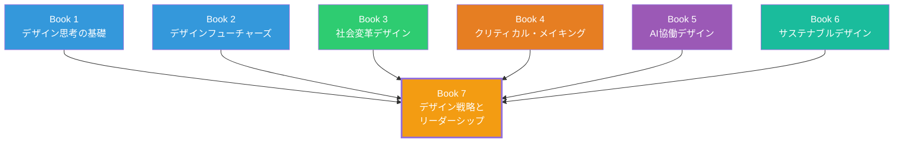

# Book 7: デザイン戦略とリーダーシップ

**Design Strategy & Leadership**

## 本書について

デザイナーの役割は、かつてないほど拡張している。優れたビジュアルを生み出す能力だけでなく、組織を導き、事業戦略にデザインの視点を統合し、社会全体の変革を構想する力が求められる時代である。

本書『デザイン戦略とリーダーシップ』は、デザイナーカリキュラム全7巻の最終巻であり、**カプストーン（集大成）**として位置づけられる。Book 1からBook 6で培ったデザイン思考、未来洞察、社会変革、クリティカル・メイキング、AI協働、サステナビリティの知識と技術を統合し、デザインを経営・組織・社会の文脈でリードするための実践知を体系化した。

2026年現在、Fortune 500企業の70%以上がCDO（Chief Design Officer）またはそれに準ずる役職を設置し、デザインは「コストセンター」から「バリュードライバー」へと認識を転換している。この潮流の中で、デザイナーがリーダーシップを発揮するために必要な知識と実践力を本書で獲得してほしい。

## 学習目標

本書を通じて、読者は以下の能力を獲得する。

| 目標 | 内容 | 対応章 |
|------|------|--------|
| **デザイン経営の理解** | デザインが経営に与えるインパクトを定量的・定性的に説明し、経営層と対話できる | 第1章 |
| **サービスデザインの実践** | サービスブループリントを用いて顧客体験全体を設計・改善できる | 第2章 |
| **トランジションデザインの構想** | 長期的視野で社会システムの転換を設計し、ステークホルダーを巻き込める | 第3章 |
| **デザイン組織の構築** | 組織内でデザインチームを立ち上げ、スケールさせ、文化を醸成できる | 第4章 |
| **キャリアの自律的構築** | 説得力のあるポートフォリオを構築し、継続的に成長する習慣を確立できる | 第5章 |

## 対象読者

- デザインリーダーを目指す実務経験3年以上のデザイナー
- デザイン部門を立ち上げ・強化したいマネージャー
- 事業戦略にデザインを統合したい経営者・起業家
- カリキュラムBook 1〜6を修了し、総合的な実践力を身につけたい学習者

!!! note "前提知識"
    本書はカリキュラムの集大成として、Book 1〜6の内容を前提とする。特にBook 1（デザイン思考の基礎）、Book 3（社会変革デザイン）、Book 5（AIパートナーシップデザイン）の内容を頻繁に参照する。未修了の場合は、該当巻の概要章を事前に確認することを推奨する。

## 章構成

### [第1章 デザイン経営](ch01-design-management.md)

デザインドリブン・イノベーション、デザイン成熟度モデル、デザインのROI測定など、経営とデザインの交差点を探る。McKinsey Design Indexを始めとする実証的フレームワークを学び、CDOの役割とデザインKPIの設計に取り組む。

### [第2章 サービスデザイン](ch02-service-design.md)

サービスブループリント、カスタマージャーニーオーケストレーション、タッチポイント設計など、サービス全体を設計する方法論を習得する。民間サービスから公共サービスまで、デジタルとフィジカルを横断した設計実践を扱う。

### [第3章 トランジションデザイン](ch03-transition-design.md)

カーネギーメロン大学のフレームワークに基づき、社会技術システムの長期的な転換をデザインする方法論を学ぶ。マルチレベルパースペクティブ（MLP）やトランジションマネジメントなど、システムレベルの変革を導く手法を探求する。

### [第4章 デザイン組織論](ch04-design-organizations.md)

中央集権型・分散型・ハイブリッド型のチーム構造、DesignOpsの構築、デザイン文化の醸成、採用と育成など、デザイン組織を成長させるための実践的な知識を体系化する。

### [第5章 ポートフォリオと実践](ch05-portfolio-practice.md)

2026年のデザイン業界で求められるポートフォリオの構築方法、ケーススタディストーリーテリング、パーソナルブランド、キャリアパスの選択、継続的学習の習慣化について実践的に学ぶ。

## 学習の進め方

!!! tip "推奨学習ペース"
    各章に1〜2週間をかけ、約2〜3ヶ月で本書全体を修了することを推奨する。本書はカリキュラムの集大成であるため、各章末の演習では実際のプロジェクトやポートフォリオ制作に取り組むことを強く推奨する。

1. **通読と内省** — 各章を読みながら、自身のキャリアや組織の状況と照らし合わせる
2. **フレームワークの適用** — 紹介されるフレームワークを実際の事例に適用してみる
3. **演習の実施** — 章末の演習は可能な限り実案件をベースに取り組む
4. **ピアレビュー** — 同僚やコミュニティメンバーとアウトプットを共有し、フィードバックを得る

## 本書と他巻との関係

本書は全巻の知識が収束する地点である。デザイン思考（Book 1）を経営に適用し、未来洞察（Book 2）をトランジションデザインに活かし、社会変革（Book 3）をサービスデザインで実装し、AI協働（Book 5）とサステナビリティ（Book 6）を組織に根付かせる――この統合こそが、デザイン戦略とリーダーシップの本質である。
