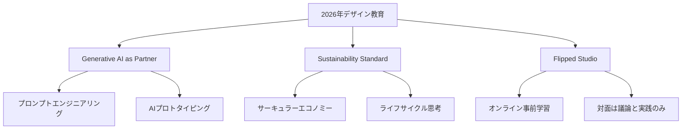

# カリキュラム概要

## 主要校のカリキュラム分析（2026年版）

### Royal College of Art（RCA / 英国）：デザイン・フューチャーズへの傾倒

世界ランキング1位を維持するRCAは、2026年、**「Design Futures（デザインの未来学）」**を中核に据えています。

- **特徴**: 「何を作るか」ではなく「どんな未来（Alternative Futures）を提示するか」に重点
- **主要メソッド**: STEEPV分析（社会・技術・経済・環境・政治・価値観）を用いたシナリオプランニング、デザインフィクション（SF的手法を用いたプロトタイピング）
- **批判的視点**: 非常に学術的・思弁的（Speculative）である反面、即戦力としての実務スキルを求める層には「概念的すぎる」というリスクを孕む

### Parsons School of Design（パーソンズ / 米国）：社会正義と都市生態学

パーソンズは、デザインを「社会変革の武器」と定義しています。

- **特徴**: **「Urban Ecologies（都市生態学）」や「Inclusive Design（包摂的デザイン）」**がカリキュラムの柱。人種、格差、気候変動といった政治的・社会的問題にデザインで介入する手法を教える
- **新傾向**: 2026年には「1年制オンライン修士課程」の拡充が進み、社会人のキャリアチェンジを加速
- **批判的視点**: 人文学系の予算削減や組織再編が進んでおり、教育の質が維持されるか、あるいは単なる「職業訓練」化の瀬戸際

### RISD（ロードアイランド・スクール・オブ・デザイン / 米国）：物質性と計算の融合

「手を動かすこと（Making）」を神聖視してきたRISDですが、現在はそこに**「Physical Computing」**を高度に融合させています。

- **特徴**: 伝統的なガラス工芸や家具製作のスタジオに、Arduinoや生成AIを用いたデジタルレイヤーを重ねる**「Critical Making」**が主流
- **主要科目**: 「Design with Electrons（電子を用いたデザイン）」など、テクノロジーを単なるツールではなく「素材」として扱う感覚を養成

## 2026年の共通トレンド：3つのキーワード

### 1. Generative AI as a Partner
AIを「競合」ではなく、リサーチからプロトタイピングまでの「共同作業者」としてカリキュラムの全工程に組み込み。プロンプトエンジニアリングはもはや前提条件。

### 2. Sustainability Standard
サステナビリティは「選択肢」ではなく、全プログラムの90%以上で「必須要件」化。サーキュラー・エコノミー（循環型経済）の理解なしに卒業は不可能。

### 3. Flipped Studio（反転スタジオ）
講義はオンラインやAIチューターで事前に済ませ、対面のスタジオ時間は「高度な議論と実践」のみに特化。

## 冷静な総括と批判的目線

現在のデザイン教育は、**「美的な完成度」よりも「戦略的な思考力」と「倫理的な責任感」**に偏重しています。これは複雑化する世界において必然の進化ですが、以下の懸念も浮き彫りになっています。

!!! warning "スキルの空洞化"
    思考（Thinking）に重きを置きすぎるあまり、デザイナーとしての「基礎的なクラフトマンシップ」が軽視されつつあります。

!!! warning "高騰するコスト"
    2026年の学費は上昇を続けており、教育が「エリート層の知的遊戯」になり、本来の目的である「多様な視点による社会変革」と矛盾し始めています。

## 本カリキュラムの設計思想

本カリキュラムは、RCAの「未来予測手法」とRISDの「テクノロジーを素材として扱う感覚」の掛け合わせを軸に、Parsonsの「社会正義」の視点を統合した、実践的かつ批判的なデザイン教育プログラムです。

| 設計原則 | 説明 |
|----------|------|
| **理論と実践の均衡** | 思弁的思考とクラフトマンシップの両立 |
| **AI共生** | 全科目でAIを協働パートナーとして活用 |
| **サステナビリティ必須** | 環境配慮を全プロジェクトの前提条件に |
| **批判的視座** | デザインの社会的責任を常に問い続ける |
| **反転スタジオ** | 知識獲得は事前に、対面は実践に集中 |
