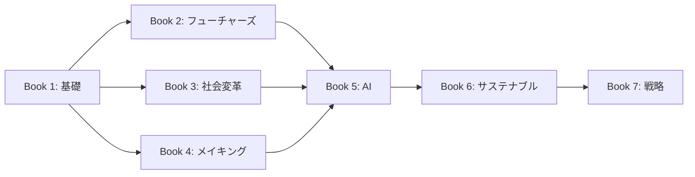

# デザイナー・カリキュラム 2026

**世界トップデザインスクールに学ぶ、次世代デザイン教育の完全ガイド**

---

## このカリキュラムについて

2026年現在、世界のトップデザインスクール（RCA、Parsons、RISDなど）のカリキュラムは、単なる「造形」の習得から、**「複雑なシステム（社会・環境・AI）の再構築」**へと完全にシフトしています。

本カリキュラムは、各校の最新カリキュラムを調査・分析し、共通して見られる支配的な潮流と各校の独自性を統合した、包括的なデザイン教育プログラムです。

## カリキュラム構成：7冊の本

| # | 書名 | テーマ | 影響元 |
|---|------|--------|--------|
| 1 | [デザイン思考の基礎](books/01-design-thinking/index.md) | 基礎的なデザイン思考とリサーチ手法 | 共通基盤 |
| 2 | [デザイン・フューチャーズ](books/02-design-futures/index.md) | 未来予測とスペキュラティブデザイン | RCA |
| 3 | [社会変革デザイン](books/03-social-transformation/index.md) | 包摂的デザインと都市生態学 | Parsons |
| 4 | [クリティカル・メイキング](books/04-critical-making/index.md) | 物質性とテクノロジーの融合 | RISD |
| 5 | [AIパートナーシップデザイン](books/05-ai-partnership/index.md) | 生成AIとの協働 | 2026トレンド |
| 6 | [サステナブルデザイン](books/06-sustainable-design/index.md) | 循環型経済とリジェネラティブ | 2026トレンド |
| 7 | [デザイン戦略とリーダーシップ](books/07-design-strategy/index.md) | 経営・組織・実践 | 統合 |

## 2026年の3大トレンド

### Generative AI as a Partner
AIを「競合」ではなく、リサーチからプロトタイピングまでの「共同作業者」としてカリキュラムの全工程に組み込んでいます。プロンプトエンジニアリングはもはや前提条件です。

### Sustainability Standard
サステナビリティは「選択肢」ではなく、全プログラムの90%以上で「必須要件」化されています。サーキュラー・エコノミーの理解なしに卒業は不可能です。

### Flipped Studio（反転スタジオ）
講義はオンラインやAIチューターで事前に済ませ、対面のスタジオ時間は「高度な議論と実践」のみに特化させる、徹底的な効率化が進んでいます。

## 学習の進め方

!!! tip "推奨学習パス"
    Book 1で基礎を固めた後、Book 2〜4は興味や専門性に応じて並行して学習可能です。Book 5以降は順番に進めることを推奨します。
