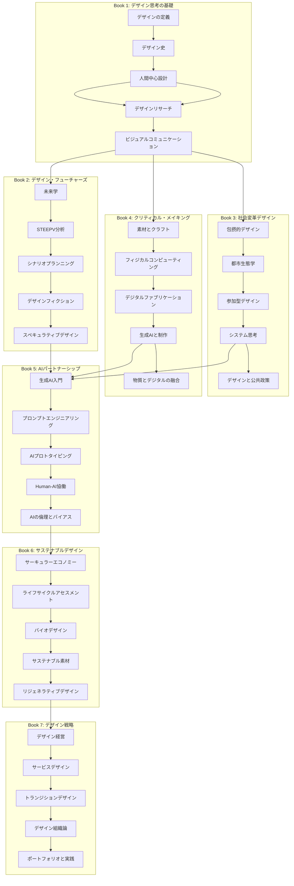
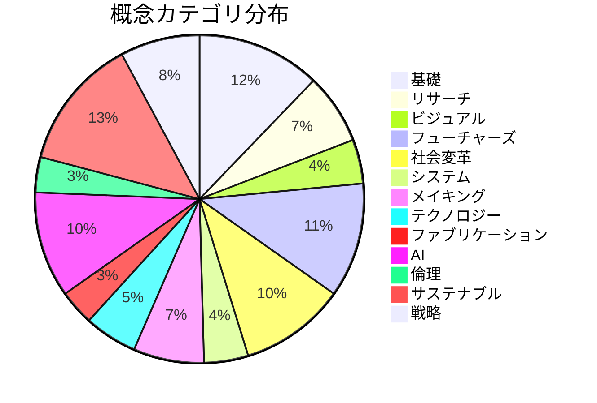

# 学習グラフ

## カリキュラム全体の概念依存関係

本カリキュラムの200以上の概念がどのように関連し、依存しているかを示す学習グラフです。

## 概念一覧（主要概念）

| ID | 概念 | 所属Book | 依存する概念 | タクソノミー |
|----|------|----------|-------------|-------------|
| 001 | デザインの定義 | Book 1 | - | 基礎 |
| 002 | デザイン史 | Book 1 | 001 | 基礎 |
| 003 | 人間中心設計 | Book 1 | 002 | 基礎 |
| 004 | エンパシーマッピング | Book 1 | 003 | リサーチ |
| 005 | ペルソナ作成 | Book 1 | 003, 004 | リサーチ |
| 006 | ジャーニーマッピング | Book 1 | 005 | リサーチ |
| 007 | デザインリサーチ | Book 1 | 003 | リサーチ |
| 008 | エスノグラフィー | Book 1 | 007 | リサーチ |
| 009 | コンテクスチュアルインクワイアリ | Book 1 | 007 | リサーチ |
| 010 | タイポグラフィ | Book 1 | 001 | ビジュアル |
| 011 | 色彩理論 | Book 1 | 001 | ビジュアル |
| 012 | レイアウト原則 | Book 1 | 010, 011 | ビジュアル |
| 013 | 情報デザイン | Book 1 | 012 | ビジュアル |
| 014 | データビジュアリゼーション | Book 1 | 013 | ビジュアル |
| 015 | 未来学 | Book 2 | 007 | フューチャーズ |
| 016 | フューチャーズ・コーン | Book 2 | 015 | フューチャーズ |
| 017 | STEEPV分析 | Book 2 | 015 | フューチャーズ |
| 018 | トレンドスキャニング | Book 2 | 017 | フューチャーズ |
| 019 | 弱い信号の検出 | Book 2 | 018 | フューチャーズ |
| 020 | シナリオプランニング | Book 2 | 017 | フューチャーズ |
| 021 | 2x2シナリオマトリクス | Book 2 | 020 | フューチャーズ |
| 022 | バックキャスティング | Book 2 | 020 | フューチャーズ |
| 023 | デザインフィクション | Book 2 | 020 | フューチャーズ |
| 024 | SFプロトタイピング | Book 2 | 023 | フューチャーズ |
| 025 | ダイエジェティック・プロトタイプ | Book 2 | 023 | フューチャーズ |
| 026 | スペキュラティブデザイン | Book 2 | 023 | フューチャーズ |
| 027 | クリティカルデザイン | Book 2 | 026 | フューチャーズ |
| 028 | 包摂的デザイン | Book 3 | 003 | 社会変革 |
| 029 | ユニバーサルデザイン | Book 3 | 028 | 社会変革 |
| 030 | アクセシビリティ | Book 3 | 028 | 社会変革 |
| 031 | インターセクショナリティ | Book 3 | 028 | 社会変革 |
| 032 | 都市生態学 | Book 3 | 028 | 社会変革 |
| 033 | プレイスメイキング | Book 3 | 032 | 社会変革 |
| 034 | タクティカルアーバニズム | Book 3 | 032 | 社会変革 |
| 035 | 参加型デザイン | Book 3 | 003 | 社会変革 |
| 036 | コデザイン | Book 3 | 035 | 社会変革 |
| 037 | デザインジャスティス | Book 3 | 035, 031 | 社会変革 |
| 038 | システム思考 | Book 3 | 007 | システム |
| 039 | 因果ループ図 | Book 3 | 038 | システム |
| 040 | レバレッジポイント | Book 3 | 038 | システム |
| 041 | ウィキッドプロブレム | Book 3 | 038 | システム |
| 042 | 公共政策デザイン | Book 3 | 038, 035 | 社会変革 |
| 043 | ナッジ理論 | Book 3 | 042 | 社会変革 |
| 044 | シビックテクノロジー | Book 3 | 042 | テクノロジー |
| 045 | 素材リテラシー | Book 4 | 001 | メイキング |
| 046 | クラフトマンシップ | Book 4 | 045 | メイキング |
| 047 | マテリアル主導デザイン | Book 4 | 045 | メイキング |
| 048 | Arduino | Book 4 | 045 | テクノロジー |
| 049 | センサーとアクチュエータ | Book 4 | 048 | テクノロジー |
| 050 | インタラクティブインスタレーション | Book 4 | 048 | メイキング |
| 051 | タンジブルインターフェース | Book 4 | 048 | テクノロジー |
| 052 | 3Dプリンティング | Book 4 | 045 | ファブリケーション |
| 053 | レーザーカッティング | Book 4 | 045 | ファブリケーション |
| 054 | パラメトリックデザイン | Book 4 | 052 | ファブリケーション |
| 055 | ジェネラティブデザイン | Book 4 | 054 | ファブリケーション |
| 056 | AI画像生成 | Book 4 | 055 | AI |
| 057 | AI 3D生成 | Book 4 | 056 | AI |
| 058 | スマートテキスタイル | Book 4 | 048, 045 | メイキング |
| 059 | レスポンシブ環境 | Book 4 | 058, 050 | メイキング |
| 060 | バイオマテリアル | Book 4 | 045 | サステナブル |
| 061 | 大規模言語モデル | Book 5 | 013 | AI |
| 062 | 拡散モデル | Book 5 | 061 | AI |
| 063 | マルチモーダルAI | Book 5 | 061 | AI |
| 064 | プロンプトエンジニアリング | Book 5 | 061 | AI |
| 065 | チェインオブソート | Book 5 | 064 | AI |
| 066 | フューショットプロンプティング | Book 5 | 064 | AI |
| 067 | AIプロトタイピング | Book 5 | 064 | AI |
| 068 | ジェネラティブUI | Book 5 | 067 | AI |
| 069 | コード生成 | Book 5 | 067 | AI |
| 070 | Human-AI協働 | Book 5 | 067 | AI |
| 071 | ヒューマンインザループ | Book 5 | 070 | AI |
| 072 | 拡張された創造性 | Book 5 | 070 | AI |
| 073 | アルゴリズムバイアス | Book 5 | 070 | 倫理 |
| 074 | 公平性指標 | Book 5 | 073 | 倫理 |
| 075 | 責任あるAIデザイン | Book 5 | 073 | 倫理 |
| 076 | AIガバナンス | Book 5 | 075 | 倫理 |
| 077 | サーキュラーエコノミー | Book 6 | 038 | サステナブル |
| 078 | 生物サイクル | Book 6 | 077 | サステナブル |
| 079 | 技術サイクル | Book 6 | 077 | サステナブル |
| 080 | プロダクト・アズ・サービス | Book 6 | 077 | サステナブル |
| 081 | ライフサイクルアセスメント | Book 6 | 077 | サステナブル |
| 082 | カーボンフットプリント | Book 6 | 081 | サステナブル |
| 083 | クレイドル・トゥ・クレイドル | Book 6 | 081 | サステナブル |
| 084 | バイオミミクリー | Book 6 | 060 | サステナブル |
| 085 | 菌糸体マテリアル | Book 6 | 084 | サステナブル |
| 086 | 藻類ベースデザイン | Book 6 | 084 | サステナブル |
| 087 | 合成生物学 | Book 6 | 084 | サステナブル |
| 088 | マテリアルヘルス | Book 6 | 045 | サステナブル |
| 089 | マテリアルパスポート | Book 6 | 088 | サステナブル |
| 090 | リジェネラティブデザイン | Book 6 | 077 | サステナブル |
| 091 | プラネタリーバウンダリー | Book 6 | 090 | サステナブル |
| 092 | デザイン経営 | Book 7 | 007, 038 | 戦略 |
| 093 | デザイン成熟度モデル | Book 7 | 092 | 戦略 |
| 094 | デザインROI | Book 7 | 092 | 戦略 |
| 095 | サービスデザイン | Book 7 | 003, 006 | 戦略 |
| 096 | サービスブループリント | Book 7 | 095 | 戦略 |
| 097 | タッチポイントデザイン | Book 7 | 095 | 戦略 |
| 098 | トランジションデザイン | Book 7 | 038, 090 | 戦略 |
| 099 | 社会技術的遷移 | Book 7 | 098 | 戦略 |
| 100 | デザインオプス | Book 7 | 092 | 戦略 |

## タクソノミー分布

## 学習パスの推奨

### パス1：未来予測型デザイナー（RCA型）
Book 1 → Book 2 → Book 5 → Book 7

### パス2：社会変革型デザイナー（Parsons型）
Book 1 → Book 3 → Book 6 → Book 7

### パス3：メイカー型デザイナー（RISD型）
Book 1 → Book 4 → Book 5 → Book 6

### パス4：フルスタックデザイナー（推奨）
Book 1 → Book 2 → Book 3 → Book 4 → Book 5 → Book 6 → Book 7
